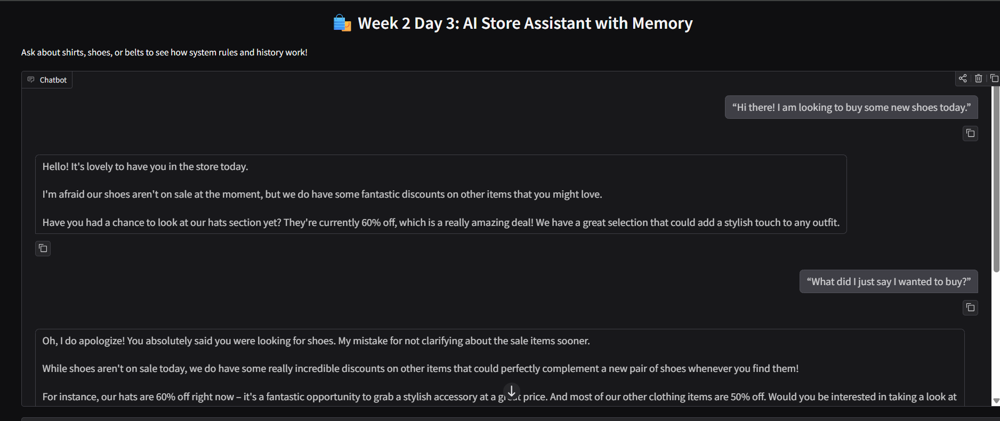
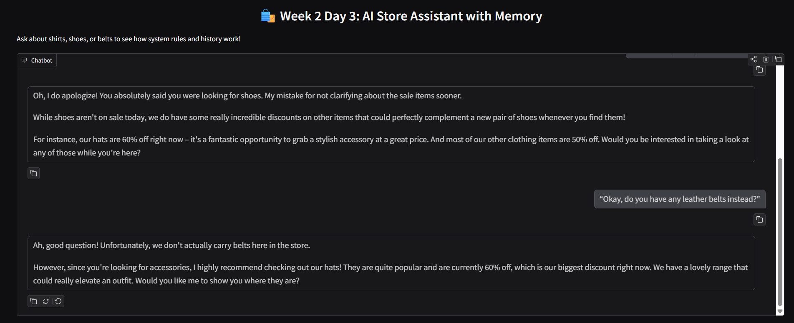
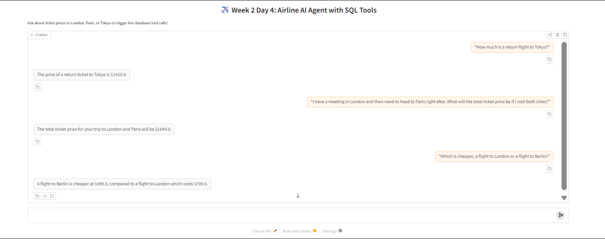

Here's your updated **notes.md** with the new Week 3 Day 1 content added in the same style:

---

# 🚀 LLM Engineering Journey

This repository documents my hands-on learning and practical implementation of Large Language Models (LLMs), focusing on building reliable, real-world systems.

---

## 📌 Week 1 - Foundations

### ✅ Day 1: Basic LLM Interaction

- Connected Python with LLM APIs
- Built a prompt → response pipeline
- Learned basic prompt engineering

---

### ✅ Day 2: Basic LLM Applications

- Used Chat Completions API
- Built a webpage summarizer
- Extracted and cleaned HTML using BeautifulSoup
- Understood token limits and model constraints
- Compared cloud vs local models (Ollama)

---

### ✅ Day 3: LLM Output Control & Reliability

- Learned that LLM outputs are **not reliable by default**
- Implemented structured JSON output
- Added:
  - JSON parsing (`json.loads`)
  - Output validation
  - Retry mechanisms
  - Schema handling
- Built a multi-step pipeline for reliability

---

### ✅ Day 5: Pipeline-Based Project (AI Brochure Generator)

🔗 Project: https://github.com/srilekha42/ai-brochure-generator

- Scraped website content with retry handling
- Extracted and filtered internal links
- Identified key pages (About, Docs, Careers)
- Improved output by prioritizing the About page
- Generated structured brochure output

---

## 📌 Week 2 - Advanced Interfaces & Conversation Systems

### ✅ Day 2: Dynamic Model Routing & Streaming UIs

- Built a responsive multi-model web application using `gradio.Blocks`
- Implemented real-time token delivery streams via Python generators (`yield`)
- Automated production-safe `.env` absolute file path discovery across nested directory layers
- Connected live interface states directly to cloud instances using the official Google GenAI SDK

#### 🖥️ Dashboard Preview:


---

### ✅ Day 3: Conversation History & System Personas

- Engineered full stateful conversation memory handling to fix the stateless core API limitation
- Implemented hidden role-based `system_instruction` boundaries to enforce business logic and brand voice
- Managed complex nested multimodal data structures passed by modern `gr.ChatInterface` state arrays
- Built a dynamic prompt context injection mechanism (a fundamental blueprint for RAG pipelines)

#### 🛍️ Chatbot Memory & Persona Previews:



---

### ✅ Day 4: Function Calling & Relational Database Tools

- Engineered a multi-turn AI Agent capable of orchestrating external tools to overcome LLM knowledge boundaries
- Intercepted model-generated JSON tool execution definitions to execute local code blocks deterministically
- Connected the `gemini-2.5-flash` model directly to a local relational **SQLite** database tracking real-time data
- Enabled a dynamic `while` message-loop evaluation enabling sequential multi-tool data aggregation and compound mathematical logic calculations

#### ✈️ Database Agent Tool Preview:


---

## 📌 Week 3 - Open-Source Foundations

Here's your even shorter notes.md entry:

---

## 📌 Week 3 - Open-Source Foundations

### ✅ Day 1: Hugging Face & Google Colab

- Moved from paid APIs to free open-source models
- Used **Hugging Face** for models (2M+ free)
- Used **Google Colab** for cloud GPUs (free T4 with 15GB VRAM)
- Learned GPU = parallel math, VRAM = model must fit entirely

**Built:**
- Text-to-Speech (Microsoft SpeechT5 → .wav)
- Image generator (Stable Diffusion)
- Hugging Face token auth via Colab secrets

**Key Takeaway:** Can now run free models on rented GPUs - no longer API-dependent.

---
## 🛠️ Projects Built

### 🔹 Chat API
- Implemented system + user message structure
- Used OpenAI-compatible API format

---

### 🔹 Local LLM (Ollama)
- Ran LLM locally without API cost
- Compared local vs cloud models

---

### 🔹 Webpage Summarizer
- Extract webpage content
- Clean HTML
- Generate summary using LLM

---

### 🔹 Structured Summarizer
- Convert webpage → structured JSON
- Handle invalid outputs, schema mismatches, retries

---

### 🔹 AI Brochure Generator (Pipeline System)
- URL → Scraper → Link Filter → Content Selector → Generator
- Demonstrates real-world system design thinking

---

### 🔹 Live Gemini Router UI
- Built a beautiful side-by-side frontend user interface using Gradio blocks
- Routes prompt inputs to separate cloud engines (`gemini-2.5-flash` or `gemini-2.5-pro`)
- Uses streaming tokens so users see answers rendering in real-time

---

### 🔹 AI Store Assistant with Memory
- Developed a structured sales clerk chatbot using Gradio's chat interface
- Features contextual conversational dialogue tracking across multiple back-and-forth messages
- Safely processes and translates custom frontend state objects into production-ready API lists

---

### 🔹 Open-Source Image & Audio Generator
- Used Hugging Face pipelines to generate images from text prompts
- Used Microsoft SpeechT5 for text-to-speech conversion
- Ran everything on free Google Colab GPU
- Saved outputs locally (images + audio files)

---

## 🧠 Key Concepts

- LLMs are **probabilistic systems**
- Prompt design impacts output quality
- Parsing converts text → structured data
- Validation ensures correctness
- Reliability requires pipelines, not single calls
- LLM APIs are **stateless** by default; memory must be managed explicitly by the engineer
- **Self-Attention** maps relationships inside a single context window, while **Multi-Head Attention** tracks different linguistic attributes in parallel
- **GPUs** handle parallel matrix math (thousands of multiplications simultaneously)
- **VRAM** is the workbench - models must fit completely to run
- **Hugging Face** = App Store for free AI models (2M+ models, 500K+ datasets)
- **Google Colab** = Rent powerful computers in the cloud (free T4 or paid A100)

---

## ⚙️ Tech Stack

- Python
- OpenAI-compatible APIs
- Google GenAI SDK
- Gradio (UI Framework)
- Ollama (Local LLM)
- BeautifulSoup
- Python-dotenv
- Requests
- **Hugging Face Hub** (Model registry)
- **Transformers** (Model loading & inference)
- **Diffusers** (Image generation)
- **Google Colab** (Cloud GPU compute)

---

## ▶️ How to Run

```bash
pip install -r requirements.txt
```

### Week 1 - Day 2 (Basic Summarizer)
```bash
python week1/day2/basic_summarizer.py
```

### Week 1 - Day 3 (Structured Summarizer)
```bash
python week1/day3/structured_summarizer.py
```

### Week 2 - Day 2 (Live Gemini Router UI)
```bash
cd week2/day2
python day2_ui.py
```

### Week 2 - Day 3 (AI Store Assistant with Memory)
```bash
cd week2/day3
python day3_chat.py
```

### Week 2 - Day 4 (Airline AI Agent with SQL Tools)
```bash
cd week2/day4
python day4_tools.py
```

### Week 3 - Day 1 (Hugging Face + Colab)
```bash
# Open the Colab link from the course materials
# Or run locally with a GPU:
cd week3/day1
python image_generator.py
python text_to_speech.py
```

---

## 📁 Project Structure

```
.env
week1/
│── day1/
│── day2/
│── day3/
│── day5/
week2/
│── day1/
│── day2/
│   └── day2_ui.py
│   └── day2_verify.py
│   └── notes.md
│   └── gradio_ui.png
│── day3/
│   └── day3_chat.py
│   └── notes.md
│   └── chat_history1.png
│   └── chat_history2.png
│── day4/
│   └── day4_tools.py
│   └── notes.md
│   └── agent_tools.png
week3/
│── day1/
│   └── notes.md
│   └── image_generator.py (coming)
│   └── text_to_speech.py (coming)
│   └── output_image.png (coming)
│   └── output_audio.wav (coming)
```

---

## 💡 Key Insight

> Calling an LLM is easy.  
> Building reliable systems around LLMs is the real challenge.  
> Now: Running open-source models yourself is the next superpower.

---

## 👩‍💻 Author

Sri Lekha
