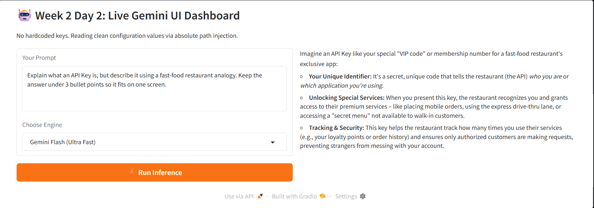

# 🚀 LLM Engineering Journey

This repository documents my hands-on learning and practical implementation of Large Language Models (LLMs), focusing on building reliable, real-world systems.

---

## 📌 Week 1 - Foundations

### ✅ Day 1: Basic LLM Interaction

* Connected Python with LLM APIs
* Built a prompt → response pipeline
* Learned basic prompt engineering

---

### ✅ Day 2: Basic LLM Applications

* Used Chat Completions API
* Built a webpage summarizer
* Extracted and cleaned HTML using BeautifulSoup
* Understood token limits and model constraints
* Compared cloud vs local models (Ollama)

---

### ✅ Day 3: LLM Output Control & Reliability

* Learned that LLM outputs are **not reliable by default**
* Implemented structured JSON output
* Added:

  * JSON parsing (`json.loads`)
  * Output validation
  * Retry mechanisms
  * Schema handling
* Built a multi-step pipeline for reliability

---

### ✅ Day 5: Pipeline-Based Project (AI Brochure Generator)

🔗 Project: https://github.com/srilekha42/ai-brochure-generator

* Scraped website content with retry handling
* Extracted and filtered internal links
* Identified key pages (About, Docs, Careers)
* Improved output by prioritizing the About page
* Generated structured brochure output

---


## 📌 Week 2 - Advanced Interfaces & Conversation Systems

### ✅ Day 2: Dynamic Model Routing & Streaming UIs

* Built a responsive multi-model web application using `gradio.Blocks`
* Implemented real-time token delivery streams via Python generators (`yield`)
* Automated production-safe `.env` absolute file path discovery across nested directory layers
* Connected live interface states directly to cloud instances using the official Google GenAI SDK

#### 🖥️ Dashboard Preview:


---
## 🛠️ Projects Built

### 🔹 Chat API

* Implemented system + user message structure
* Used OpenAI-compatible API format

---

### 🔹 Local LLM (Ollama)

* Ran LLM locally without API cost
* Compared local vs cloud models

---

### 🔹 Webpage Summarizer

* Extract webpage content
* Clean HTML
* Generate summary using LLM

---

### 🔹 Structured Summarizer

* Convert webpage → structured JSON
* Handle invalid outputs, schema mismatches, retries

---

### 🔹 AI Brochure Generator (Pipeline System)

* URL → Scraper → Link Filter → Content Selector → Generator
* Demonstrates real-world system design thinking

---
### 🔹 Live Gemini Router UI
* Built a beautiful side-by-side frontend user interface using Gradio blocks
* Routes prompt inputs to separate cloud engines (`gemini-2.5-flash` or `gemini-2.5-pro`)
* Uses streaming tokens so users see answers rendering in real-time
---

## 🧠 Key Concepts

* LLMs are **probabilistic systems**
* Prompt design impacts output quality
* Parsing converts text → structured data
* Validation ensures correctness
* Reliability requires pipelines, not single calls
* LLM APIs are **stateless** by default; memory must be managed explicitly by the engineer
* **Self-Attention** maps relationships inside a single context window, while **Multi-Head Attention** tracks different linguistic attributes in parallel

---

## ⚙️ Tech Stack

* Python
* OpenAI-compatible APIs
* Google GenAI SDK
* Gradio (UI Framework)
* Ollama (Local LLM)
* BeautifulSoup
* Python-dotenv
* Requests
---

## ▶️ How to Run

```bash
pip install -r requirements.txt
```

### Week 1 - Day 2 (Basic Summarizer)

```bash
python week1/day2/basic_summarizer.py
```

### Week 1 - Day 3 (Structured Summarizer)

```bash
python week1/day3/structured_summarizer.py
```
### Week 2 - Day 2 (Live Gemini Router UI)
```bash
cd week2/day2
python day2_ui.py
```
## 📁 Project Structure

.env
week1/
│── day1/
│── day2/
│── day3/
│── day5/
week2/
│── day1/
│── day2/
    └── day2_ui.py
    └── day2_verify.py
    └── notes.md
    └── gradio_ui.png

---

## 💡 Key Insight

> Calling an LLM is easy.
> Building reliable systems around LLMs is the real challenge.

---

## 👩‍💻 Author

Sri Lekha
