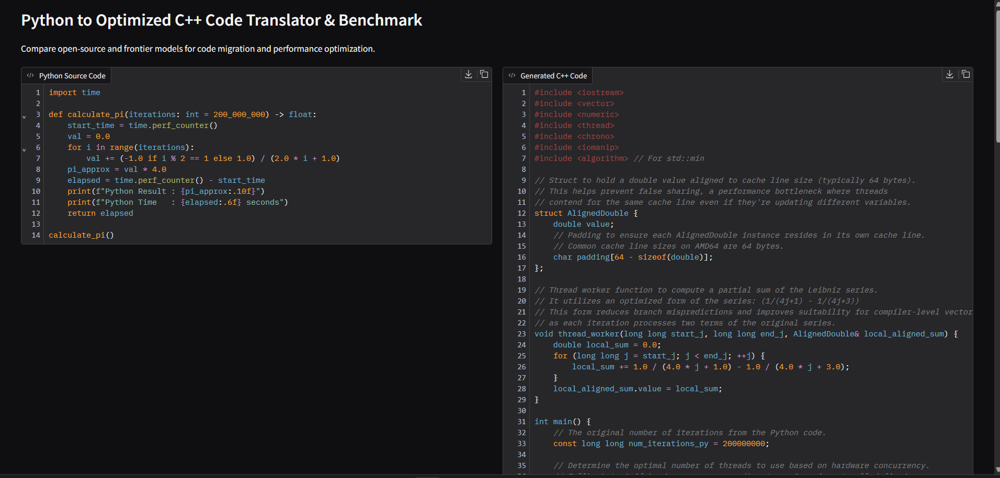
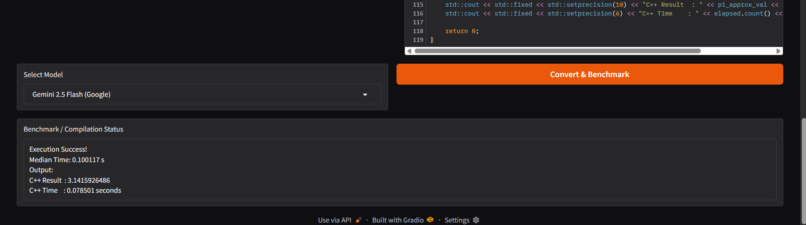

# Week 4 - Day 4: Open-Source Coding Models & Gradio Translation Pipeline

## 📌 Overview

Today I learned how to compare different AI coding models by using them to convert Python code into C++ and then testing the generated C++ code for **correctness and performance**.

I also built a **Gradio interface** to make the translation and benchmarking process easier to use.

---

## 🎯 Objective

The main goal was to understand:

- How different AI coding models can generate code.
- Why real-world testing is important when comparing AI models.
- How optimized C++ code can improve execution speed.
- How to create a simple web interface using **Gradio**.
- How to measure and compare Python and C++ execution times.

---

## 🧠 Key Concepts

### 1. Benchmarking AI Models

Leaderboards such as **Big Code Models / MultiPL-E** can help us find good coding models.

However, leaderboard results alone are not enough.

A model should also be tested on the **actual task** to check:

- Does the generated code work?
- Does it produce the correct result?
- Does it compile successfully?
- How fast does it run?

So, the main idea is:

```text
Leaderboard
     ↓
Choose Possible Models
     ↓
Test on Real Task
     ↓
Measure Results
     ↓
Choose the Better Model
```

---

### 2. Multi-threading

**Multi-threading** means using multiple CPU cores to perform different parts of a task at the same time.

Instead of:

```text
Task
 ↓
One CPU Core
 ↓
Complete Task
```

we can use:

```text
             Task
              ↓
      ┌───────┼───────┐
      ↓       ↓       ↓
   Core 1   Core 2   Core 3
      ↓       ↓       ↓
      └───────┼───────┘
              ↓
        Final Result
```

This can make compute-heavy programs faster when the work can be divided between threads.

---

### 3. False Sharing & Cache Alignment

When multiple CPU threads work at the same time, they may access nearby data stored in the same CPU cache line.

This can cause unnecessary communication between CPU cores and reduce performance.

The generated C++ code used **64-byte padding** to help keep data used by different threads separated.

This technique is called **cache-line padding**.

Simple idea:

```text
Without Padding:

Thread 1 Data | Thread 2 Data
       ↓              ↓
     Same Cache Line
           ↓
    Possible Conflict


With Padding:

Thread 1 Data + Padding | Thread 2 Data + Padding
          ↓                         ↓
     Separate Cache Lines
          ↓                         ↓
      Less Conflict
```

---

### 4. Algebraic Simplification

The Leibniz formula for calculating π contains repeated terms:

```text
1/1 - 1/3 + 1/5 - 1/7 + ...
```

The generated C++ code simplified pairs of terms:

```text
1/(4j + 1) - 1/(4j + 3)
```

This reduces some unnecessary operations and helps improve the execution speed.

---

## 🔄 Complete Pipeline

```text
Select AI Model
       ↓
Provide Python Code
       ↓
AI Generates C++ Code
       ↓
Compile C++ Code
       ↓
Run C++ Program
       ↓
Measure Execution Time
       ↓
Compare with Python
       ↓
Display Results in Gradio
```

---

## 📊 Benchmark Results

The benchmark used the same Leibniz π calculation from Day 3.

| Implementation | Execution Time | Result |
| :--- | ---: | ---: |
| Python Baseline | ~20.54 s | 3.1415926486 |
| Optimized C++ | ~0.0785 s | 3.1415926486 |

### Speedup

The optimized C++ implementation achieved approximately:

**~260× speedup**

The important point is that the C++ program was not only faster, but also produced the **same numerical result** as the Python program.

---

## 🖥️ Gradio Interface

I created a **Gradio web interface** to make the benchmarking process interactive.

The interface allows the user to:

1. Select an AI model.
2. Convert Python code into C++.
3. Compile the generated C++ code.
4. Run the benchmark.
5. View the execution time.
6. View the generated result.
7. Compare the performance with the Python baseline.

### Screenshot 1



### Screenshot 2



---

## 📁 Project Structure

```text
week4/
└── day4/
    ├── system_info.py
    ├── benchmark.py
    ├── translator.py
    ├── runner.py
    ├── app.py
    ├── main.py
    ├── assets/
    │   ├── gradio_benchmark_results1.png
    │   └── gradio_benchmark_results2.png
    └── notes.md
```

### File Purpose

| File | Purpose |
| :--- | :--- |
| `system_info.py` | Detects the operating system and compiler |
| `benchmark.py` | Contains the Python benchmark |
| `translator.py` | Connects to AI models and generates C++ |
| `runner.py` | Compiles and runs the C++ code |
| `app.py` | Provides the Gradio web interface |
| `main.py` | Runs the automated benchmark |
| `assets/` | Stores screenshots of the Gradio interface |

---

## 💡 What I Learned Today

- AI coding models can be compared using real programming tasks.
- Leaderboards are useful, but **real execution testing is important**.
- C++ can be optimized using techniques such as multi-threading and algebraic simplification.
- Multiple CPU cores can be used to perform work in parallel.
- Cache organization can affect the performance of multithreaded programs.
- Gradio can be used to create a simple interactive interface for AI applications.
- Performance should always be measured instead of assumed.

---

## 🎯 Key Takeaway

The main lesson from Day 4 is:

> **Don't choose an AI model only because it has a good benchmark score. Test it on your actual task and measure its correctness and performance.**

This project helped me understand how **AI model selection, code generation, optimization, and performance benchmarking** can be combined into one practical workflow.